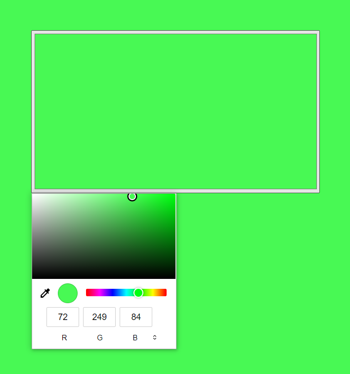

<h1 align="center">
  Ambient Light
</h1>

## Tecnologias

Esse projeto foi desenvolvido com as seguintes tecnologias:

- HTML
- CSS
- JavaScript

## Projeto

O Ambient Light é um projeto com o único objetivo de fornecer iluminação da cor desejada por telas secundárias.

## Layout

Esse é o layout do projeto.
 
 

## Acesso

O projeto pode ser acessado e testado [aqui](https://gabrielpdb.github.io/ambient-light/)

Made by [GabrielPDB](https://github.com/GabrielPDB)
